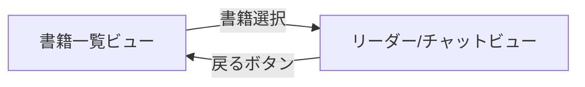

# 画面構成仕様書

## 概要
シングルページアプリケーションとして、2つのビューを切り替えて表示します。
iPad（縦向き）での使用を想定した画面設計です。

## 画面一覧

### 1. 書籍一覧ビュー（初期画面）
書籍を選択するためのライブラリ画面

### 2. リーダー/チャットビュー
電子書籍の閲覧とAIキャラクターとの対話を行う画面

---

## ヘッダー
- ビュー共通で存在
- リーダービューでは、基本は非表示し、タップ時に表示されるようにする

---

## 1. 書籍一覧ビュー

### レイアウト構成
```
┌─────────────────────────────────────────────────────────┐
│  Header                                                 │
│  ┌─────────────────────────────────────────────────┐    │
│  │  Chavel - インタラクティブ電子書籍                  │    │
│  └─────────────────────────────────────────────────┘    │
├─────────────────────────────────────────────────────────┤
│                                                         │
│  書籍グリッド（3列 × n行）                                 │
│  ┌──────────┐  ┌──────────┐  ┌──────────┐               │
│  │          │  │          │  │          │               │
│  │  Book 1  │  │  Book 2  │  │  Book 3  │               │
│  │          │  │          │  │          │               │
│  │ [表紙画像]│  │ [表紙画像] │  │ [表紙画像]│               │
│  │          │  │          │  │          │               │
│  │ タイトル  │  │ タイトル   │  │ タイトル  │               │
│  │  著者名   │  │  著者名   │  │  著者名   │               │
│  └──────────┘  └──────────┘  └──────────┘               │
│                                                         │
│  ┌──────────┐  ┌──────────┐  ┌──────────┐               │
│  │  Book 4  │  │  Book 5  │  │  Book 6  │               │
│  └──────────┘  └──────────┘  └──────────┘               │
│                                                         │
└─────────────────────────────────────────────────────────┘
```

### コンポーネント構成
- **ヘッダー** (`app/_components/book-list-header.tsx`)
  - アプリタイトル表示
  - モード切替ボタン（将来実装用）

- **書籍カード** (`app/_components/book-card.tsx`)
  - 表紙画像（アスペクト比 3:4）
  - タイトル（最大2行で省略）
  - 著者名
  - ホバー/タップ時のアニメーション

- **グリッドコンテナ** (`app/_components/book-grid.tsx`)
  - レスポンシブグリッドレイアウト
  - スクロール可能

### インタラクション
- **書籍選択**: カードをタップして書籍を開く
- **ホバー効果**: カードが少し浮き上がる
- **ローディング**: 書籍データ取得中はスケルトン表示

### レスポンシブ対応
```typescript
// Tailwind CSS クラス
const gridClasses = "grid grid-cols-2 md:grid-cols-3 lg:grid-cols-4 gap-6 p-6"
```

---

## 2. リーダー/チャットビュー

### レイアウト構成（縦向きiPad）

#### チャットコラプス状態（デフォルト）
```
┌─────────────────────────────────────────────────────────┐
│  Header Bar                                             │
│  ┌──────┐ ┌─────────────────────┐ ┌──────────────┐      │
│  │ ← 戻る│ │    書籍タイトル       │ │ 💬 チャット   │      │
│  └──────┘ └─────────────────────┘ └──────────────┘      │
├─────────────────────────────────────────────────────────┤
│                                                         │
│                   Book Reader                           │
│                                                         │
│  ┌─────────────────────────────────────────────────┐    │
│  │                                                 │    │
│  │               書籍本文                           │    │
│  │                                                 │    │
│  │            ページ内容                             │    │
│  │                                                 │    │
│  │                                                 │    │
│  │                                                 │    │
│  │                                                 │    │
│  │                                                 │    │
│  │                                                 │    │
│  └─────────────────────────────────────────────────┘    │
│                                                         │
├─────────────────────────────────────────────────────────┤
│  Page Controls (タップで表示)                             │
│  ┌─────────────────────────────────────────────────┐    │
│  │            ← P.12/100 →                         │    │
│  └─────────────────────────────────────────────────┘    │
├─────────────────────────────────────────────────────────┤
│  Chat Preview (80px)                                    |
│  ┌──────┐ ┌──────────────────────┐ ┌──────────┐         │
│  │ [A]  │ │ キャラクターAとチャット  │ │    ↑     │         │
│  └──────┘ └──────────────────────┘ └──────────┘         │
└─────────────────────────────────────────────────────────┘
```

#### チャット展開状態（上向きスワイプ後）
```
┌─────────────────────────────────────────────────────────┐
│  Chat Panel (Full Screen)                               │
│  ┌─────────────────────────────────────────────────┐   │
│  │  チャット                            ↓          │   │
│  └─────────────────────────────────────────────────┘   │
│                                                         │
│  ┌─────────────────────────────────────────────────┐   │
│  │  キャラクター選択                                │   │
│  │  [キャラA] [キャラB] [キャラC]                   │   │
│  └─────────────────────────────────────────────────┘   │
│                                                         │
│  ┌─────────────────────────────────────────────────┐   │
│  │                                                 │   │
│  │           チャット履歴エリア                      │   │
│  │                                                 │   │
│  │  [AI]: こんにちは！                               │   │
│  │  [You]: はじめまして                              │   │
│  │  [AI]: 何についてお話ししますか？                   │   │
│  │                                                 │   │
│  │                                                 │   │
│  └─────────────────────────────────────────────────┘   │
│                                                         │
│  ┌─────────────────────────────────────────────────┐   │
│  │  メッセージを入力...                    [送信]    │   │
│  └─────────────────────────────────────────────────┘   │
└─────────────────────────────────────────────────────────┘
```

### 画面状態
- **コラプス状態**: チャット80px、リーダー下部にmargin確保でページコントロールとの重なりを回避
- **展開状態**: チャット全画面、リーダー非表示

### コンポーネント構成

#### リーダーエリア (`app/_components/book-reader.tsx`)
- **ヘッダー**
  - 戻るボタン → 書籍一覧へ遷移
  - 書籍タイトル表示
  - 設定ボタン（フォントサイズ、背景色）

- **本文表示エリア**
  - 縦書き
  - ページめくりアニメーション
  - テキスト選択可能

- **ページコントロール**
  - 前ページ/次ページボタン
  - ページ番号表示（現在/総ページ数）
  - スライダーでのページジャンプ
  - 基本は非表示で、ページタップ時に表示／非表示が切り替わる

#### チャットパネル (`app/_components/chat-panel.tsx`)
- チャットパネルは、コラプス/展開の2状態を持つ
- デフォルトは80pxのコラプス状態で、上向きスワイプで全画面展開

##### コラプス状態（80px）
- **キャラクターアバター**: 現在選択中のキャラクター
- **状態表示**: "キャラクター名とチャット"
- **展開ボタン**: 上矢印アイコン

##### 展開状態（全画面）
- **ヘッダー**: "チャット" タイトルと下矢印の折りたたみボタン
- **キャラクター選択タブ**
  - 利用可能なキャラクター一覧
  - アクティブキャラクターのハイライト
  - キャラクターごとの会話は記録されていて、キャラクター変更時に表示を切り替える

- **チャット履歴**
  - メッセージバブル形式
  - AIメッセージ（左寄せ）
  - ユーザーメッセージ（右寄せ）
  - タイムスタンプ表示
  - 自動スクロール

- **入力エリア**
  - テキスト入力フィールド
  - 送信ボタン
  - 入力中インジケーター

### インタラクション詳細

#### チャット状態切り替え
```typescript
// 上向きスワイプでチャット展開
const handleSwipeUp = (deltaY: number) => {
  if (deltaY > 50 && chatState === 'collapsed') {
    setChatState('expanded');
  }
}

// 下向きスワイプでチャット折りたたみ
const handleSwipeDown = (deltaY: number) => {
  if (deltaY < -50 && chatState === 'expanded') {
    setChatState('collapsed');
  }
}
```

#### ページめくり
```typescript
// スワイプジェスチャー対応（縦書きのため左右が逆）
const handleSwipe = (direction: 'left' | 'right') => {
  if (direction === 'left') nextPage(); // 左スワイプで次ページ
  if (direction === 'right') prevPage(); // 右スワイプで前ページ
}
```

#### チャット送信
```typescript
// メッセージ送信フロー
const sendMessage = async (message: string) => {
  // 1. ユーザーメッセージを表示
  addMessage({ role: 'user', content: message });

  // 2. ローディング表示
  setIsLoading(true);

  // 3. API呼び出し（またはモック）
  const response = await chatService.send(message);

  // 4. AIレスポンス表示
  addMessage({ role: 'assistant', content: response });
}
```

---

## 画面遷移フロー



---

## スタイリング仕様

### カラーパレット
```css
/* Tailwind CSS カスタムカラー */
:root {
  --primary: #3B82F6;      /* blue-500 */
  --secondary: #10B981;    /* emerald-500 */
  --background: #F9FAFB;   /* gray-50 */
  --surface: #FFFFFF;
  --text-primary: #111827;  /* gray-900 */
  --text-secondary: #6B7280; /* gray-500 */
}

/* ダークモード */
.dark {
  --background: #111827;    /* gray-900 */
  --surface: #1F2937;       /* gray-800 */
  --text-primary: #F9FAFB;  /* gray-50 */
  --text-secondary: #9CA3AF; /* gray-400 */
}
```

### フォント設定
```typescript
// app/layout.tsx
import { Noto_Sans_JP } from 'next/font/google';

const notoSansJP = Noto_Sans_JP({
  subsets: ['latin'],
  weight: ['400', '500', '700'],
});
```

### アニメーション
```typescript
// Framer Motion 設定例
const pageTransition = {
  initial: { opacity: 0, x: 20 },
  animate: { opacity: 1, x: 0 },
  exit: { opacity: 0, x: -20 },
  transition: { duration: 0.3 }
};
```

---

## レスポンシブ設計

### ブレークポイント
- **sm**: 640px〜
- **md**: 768px〜 （iPad縦向き）
- **lg**: 1024px〜（iPad横向き）
- **xl**: 1280px〜

### 画面サイズ別レイアウト
```typescript
// iPad縦向き（768px）
const portraitLayout = "flex-col"; // 上下分割

// iPad横向き（1024px以上）
const landscapeLayout = "flex-row"; // 左右分割
```

---

## アクセシビリティ考慮

### キーボード操作
- `Tab`: フォーカス移動
- `Enter`: ボタン押下、リンク遷移
- `←/→`: ページ送り
- `Esc`: モーダルを閉じる

### ARIA属性
```tsx
<button
  aria-label="次のページへ"
  role="button"
  tabIndex={0}
>
  →
</button>
```

### フォーカス管理
```typescript
// ビュー切り替え時のフォーカス制御
useEffect(() => {
  if (currentView === 'reader') {
    readerRef.current?.focus();
  }
}, [currentView]);
```

---

## エラー状態

### 書籍一覧
- **データ取得失敗**: "書籍の読み込みに失敗しました"メッセージ表示
- **空状態**: "書籍がありません"メッセージ表示

### チャット
- **API接続エラー**: "接続できません。モックモードで実行中"表示
- **送信失敗**: エラーメッセージと再送信ボタン表示

---

## パフォーマンス考慮

### 画像最適化
```tsx
import Image from 'next/image';

<Image
  src="/book-cover.jpg"
  width={200}
  height={300}
  alt="書籍表紙"
  loading="lazy"
  placeholder="blur"
/>
```

### 仮想スクロール
大量の書籍/メッセージ表示時は react-window を使用

### コンポーネントの遅延読み込み
```typescript
const ChatPanel = dynamic(() => import('./_components/chat-panel'), {
  loading: () => <ChatPanelSkeleton />
});
```