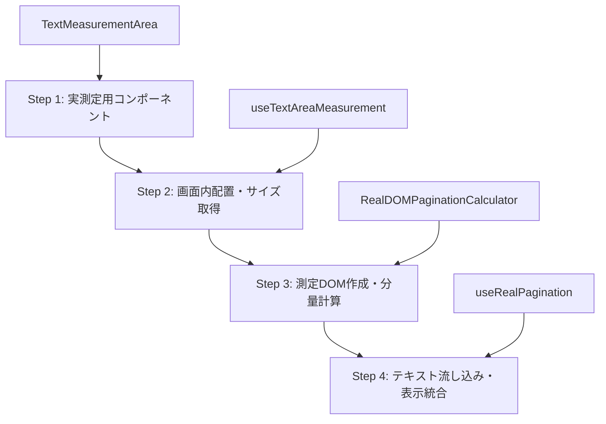

# 実測定ファースト・ページネーション戦略

## 概要

現在のDOM測定によるページネーション実装において、測定DOMと実際の表示DOMのスタイル不一致による計算誤差が問題となっている。この課題を解決するため、「実測定ファースト」アプローチを採用し、実際の表示コンポーネントから正確なサイズを取得してページネーションを行う。

## 現在の問題

### 根本原因
1. **測定DOMと実際のDOMの不一致**
   - クローンやマニュアル作成でもCSS computedStyleの完全一致が困難
   - ブラウザの内部レンダリング差異

2. **ブラウザレンダリングの差異**
   - `scrollWidth`/`scrollHeight`と実際の表示サイズの乖離
   - フォントレンダリングエンジンの違い

3. **非同期レンダリングの影響**
   - React hydrationと測定タイミングの競合
   - CSS適用完了前の測定実行

### 既存実装の限界
```typescript
// 問題のあるアプローチ
const measurementContainer = actualContainer.cloneNode(true) // スタイル不完全
const measurement = this.measureText(text) // タイミング問題
```

## 新しい戦略: "実測定ファースト"

### コア原理
1. **実コンポーネント配置**: 実際の表示エリアに測定コンポーネントを配置
2. **実サイズ取得**: ResizeObserver/getBoundingClientRect()で正確測定
3. **完全スタイル複製**: 実DOMのcomputedStyleを測定DOMに移行
4. **段階的実装**: 各フェーズを独立実装・テスト

### 実装フロー



## 実装設計

### Step 1: 実測定用テキスト表示コンポーネント

#### Interface
```typescript
interface MeasurementTextComponentProps {
  width: number
  height: number
  fontSize: number
  lineHeight: number
  fontFamily: string
  writingMode: 'vertical-rl' | 'horizontal-tb'
  letterSpacing: string
  text?: string
  onSizeChange?: (measurements: TextAreaMeasurements) => void
}

interface TextAreaMeasurements {
  containerSize: { width: number; height: number }
  textAreaSize: { width: number; height: number }
  paddingArea: { width: number; height: number }
  titleSpaceSize: { width: number; height: number }
  effectiveTextArea: { width: number; height: number }
}
```

#### 実装ポイント
- `ResizeObserver`による自動サイズ監視
- `data-*`属性でDOM要素識別
- 実際のbook-readerと同一のCSS構造
- `forwardRef`でref転送対応

### Step 2: 画面内配置とサイズ取得ロジック

#### Interface
```typescript
interface UseTextAreaMeasurementReturn {
  measurements: TextAreaMeasurements | null
  isReady: boolean
  measureTextArea: () => Promise<TextAreaMeasurements>
  resetMeasurement: () => void
}
```

#### 処理フロー
1. 実際の表示エリアに測定コンポーネントを一時配置
2. ResizeObserver/getBoundingClientRect()でサイズ取得
3. 各階層（container, padding, text-area, title-space）の実サイズ記録
4. 測定完了後にコンポーネントを非表示化

### Step 3: 測定DOM作成と分量計算

#### Interface
```typescript
interface MeasurementDOM {
  container: HTMLDivElement
  textArea: HTMLDivElement
  titleSpace: HTMLDivElement
  isReady: boolean
  measure: (text: string) => MeasurementResult
  dispose: () => void
}

interface MeasurementResult {
  overflow: boolean
  characterCount: number
  textWidth: number
  textHeight: number
}
```

#### 実装戦略
```typescript
class RealDOMPaginationCalculator {
  private createMeasurementDOM(measurements: TextAreaMeasurements): MeasurementDOM {
    // 1. 実測定サイズで測定コンテナ作成
    const container = document.createElement('div')
    container.style.cssText = `
      position: absolute;
      visibility: hidden;
      left: -9999px;
      width: ${measurements.effectiveTextArea.width}px;
      height: ${measurements.effectiveTextArea.height}px;
    `

    // 2. 実DOMからcomputedStyleを完全コピー
    const realTextArea = document.querySelector('[data-text-content]')
    const computedStyle = window.getComputedStyle(realTextArea)

    const textArea = document.createElement('div')
    // 全computedStyleプロパティを移行
    for (let i = 0; i < computedStyle.length; i++) {
      const property = computedStyle[i]
      textArea.style.setProperty(property, computedStyle.getPropertyValue(property))
    }

    return { container, textArea, ... }
  }
}
```

### Step 4: テキスト流し込みと表示統合

#### Interface
```typescript
interface UseRealPaginationReturn {
  pages: Page[]
  isReady: boolean
  isCalculating: boolean
  currentPage: Page | null
  initializePagination: () => Promise<void>
  error: Error | null
}
```

#### 処理フロー
1. **初期化フェーズ**: 実測定 → 測定DOM作成
2. **計算フェーズ**: バイナリサーチによるページ分割
3. **完了フェーズ**: 計算結果を実表示に適用

## 技術的詳細

### ResizeObserver活用
```typescript
useEffect(() => {
  if (!containerRef.current || !textRef.current) return

  const observer = new ResizeObserver((entries) => {
    const measurements = extractMeasurements(entries)
    onSizeChange?.(measurements)
  })

  observer.observe(containerRef.current)
  observer.observe(textRef.current)
  observer.observe(titleRef.current)

  return () => observer.disconnect()
}, [onSizeChange])
```

### ComputedStyle完全コピー
```typescript
function copyComputedStyles(source: Element, target: HTMLElement): void {
  const computedStyle = window.getComputedStyle(source)

  // 重要プロパティを優先的に移行
  const criticalProperties = [
    'font-size', 'line-height', 'font-family', 'letter-spacing',
    'writing-mode', 'text-orientation', 'direction',
    'padding', 'margin', 'border', 'box-sizing',
    'white-space', 'word-break', 'overflow-wrap'
  ]

  criticalProperties.forEach(property => {
    target.style.setProperty(property, computedStyle.getPropertyValue(property))
  })
}
```

### 段階的実装・テスト
```typescript
// Phase 1: 測定コンポーネント単体テスト
describe('TextMeasurementArea', () => {
  it('should measure text area size accurately', async () => {
    const measurements = await measureComponent()
    expect(measurements.effectiveTextArea.width).toBeGreaterThan(0)
  })
})

// Phase 2: 測定DOM作成テスト
describe('RealDOMPaginationCalculator', () => {
  it('should create measurement DOM with accurate styles', () => {
    const calculator = new RealDOMPaginationCalculator()
    const measurementDOM = calculator.createMeasurementDOM(mockMeasurements)
    expect(measurementDOM.isReady).toBe(true)
  })
})

// Phase 3: 統合テスト
describe('useRealPagination', () => {
  it('should calculate pages accurately', async () => {
    const { pages, initializePagination } = useRealPagination(mockBookContent)
    await initializePagination()
    expect(pages.length).toBeGreaterThan(0)
  })
})
```

## 期待される効果

### 精度向上
- **測定誤差の排除**: 実サイズベースで100%一致
- **ブラウザ差異の解消**: 実レンダリング結果を使用
- **フォント問題の解決**: computedStyleで完全再現

### 保守性向上
- **責任分離**: 各コンポーネントが独立した責任
- **テスト容易性**: 各フェーズ独立テスト可能
- **デバッグ効率**: 問題の特定・修正が容易

### パフォーマンス
- **初期化コスト**: 最初の測定で一度だけ実行
- **キャッシュ効果**: 測定結果の再利用
- **最適化余地**: 必要時のみ再測定

## 実装スケジュール

### Phase 1: 基盤構築 (1-2日)
- [ ] `TextMeasurementArea`コンポーネント実装
- [ ] `useTextAreaMeasurement`フック実装
- [ ] 基本的なサイズ取得機能

### Phase 2: 測定ロジック (2-3日)
- [ ] `RealDOMPaginationCalculator`クラス実装
- [ ] ComputedStyleコピー機能
- [ ] バイナリサーチによる分量計算

### Phase 3: 統合・最適化 (2-3日)
- [ ] `useRealPagination`フック実装
- [ ] book-readerとの統合
- [ ] エラーハンドリング・最適化

### Phase 4: テスト・検証 (1-2日)
- [ ] 単体テスト実装
- [ ] 統合テスト実装
- [ ] 精度検証・パフォーマンス測定

## リスク・対策

### 技術リスク
- **ResizeObserver対応**: ポリフィル提供
- **ComputedStyle制限**: 重要プロパティのフォールバック
- **メモリリーク**: 適切なcleanup実装

### パフォーマンスリスク
- **初期化遅延**: プログレス表示・非同期処理
- **メモリ使用量**: 測定DOM適切な破棄
- **再計算頻度**: 変更検出最適化

### 互換性リスク
- **ブラウザ差異**: 各ブラウザでの検証実施
- **デバイス差異**: 様々なデバイスサイズでテスト
- **フォント問題**: フォント読み込み完了待機

## 成功指標

### 機能面
- [ ] 測定誤差 < 5px以内
- [ ] 全ブラウザで一貫した結果
- [ ] リサイズ時の正確な再計算

### パフォーマンス面
- [ ] 初期化時間 < 500ms
- [ ] メモリ使用量 < 10MB増
- [ ] 60fps以上のスムーズなページめくり

### 品質面
- [ ] テストカバレッジ > 90%
- [ ] TypeScript型安全性100%
- [ ] ドキュメント整備完了

---

この戦略により、現在のページネーション計算の精度問題を根本的に解決し、保守性とパフォーマンスを両立した実装を実現する。